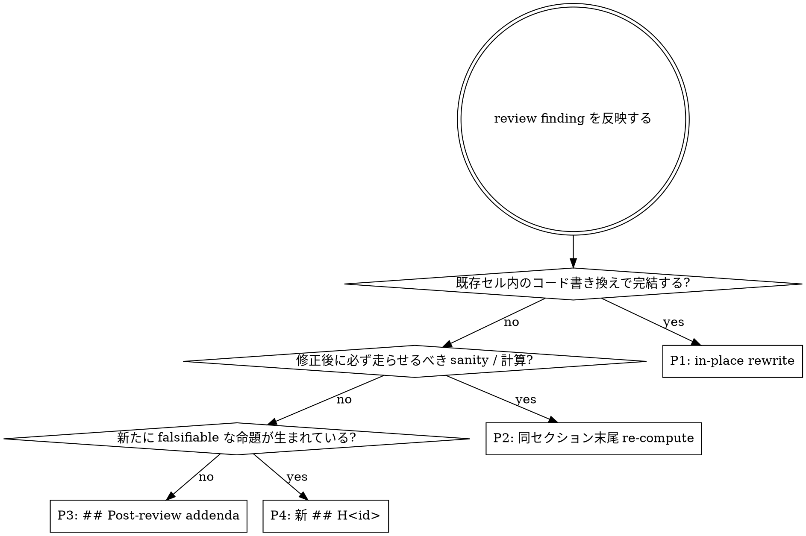

# post_review_reconciliation.md

レビュー (Step 11 `bug_review` / Step 13 `experiment-review`) の inline summary
を出した直後にノート (.py) を **当初骨格に揃え直し、依存セルを再走し、本文と
議事と計画を分離する** ための reconciliation 規定。

## When to read

- `bug_review` の inline review summary を出した直後、まだ依存セルを再走 /
  再評価していない時点
- `experiment-review` の inline review summary を出した直後
- 反映後にノートを次の人 (= 自分自身を含む) に渡す前
- そのまま `verdict = "supported"` を declare しようとしている時 (= reconciliation
  を済ませていなければ verdict は付かない)

## Why this layer exists

bug_review / experiment-review の指摘を反映する作業は、**コードを直すこと
ではない**。コード差し替えに加えて、ノート本文・図表・依存セル・past-round
findings との整合性を取り直して初めて「反映済み」と呼べる。

reconciliation 規定なしでレビュー指摘をそのまま素直に反映すると、観察される
劣化は次のとおり:

- 当初の figure plan / セクション番号 / `## H<id>` 構造から逸脱した章番号
  (`§6a / §6b / §7b / Fig 2b`) が intercalary に乱立する
- 本文 markdown に reviewer 名 / dimension / severity / case 番号などレビュー
  作法の語彙が侵入する (e.g. 「leakage-reviewer の high finding」「case B
  medium #1」「(literature dimension)」)
- 編集履歴 (「bug_review 反映後の再計算値」「~~2.4~~ → 0.93」) が abstract /
  per-H abstract / interpretation に入り、abstract が会議録になる
- 旧値の audit (`walk_forward_sharpes_pre_fix = [...]  # audit`、取り消し線) が
  コード / 本文に残る
- 「parked finding」「follow-up F1/F2」「next-session で…」などタスク管理メモが
  本文化する
- 数値だけ書き換えられて figure cell / observation cell は pre-fix narrative の
  まま、ノート全体に**修正前と修正後の文章が同居**する
- 直近 finding 単独で abstract を書き換え、過去ラウンドで反映済みのはずの
  findings との整合が崩れる

これらは `bug_review.md` / `experiment-review` の指摘内容には含まれていない、
**反映作法 (= ノートの状態を保つ作法) の問題**。本ファイルがその規定。

## Three artifacts, three purposes — 本文 / 議事 / 計画 の分離

レビュー周りには 3 つの記録レイヤーがある。ノート本文に他レイヤーの内容を
書くと劣化する。

| Layer | 場所 | 入れる情報 |
|---|---|---|
| **本文 (research artifact)** | notebook `.py` の markdown / コード | 結果、解釈、claim と限定、derived hypothesis の falsifiable な statement |
| **議事 (audit trail)** | inline review summary (chat transcript)、必要なら `decisions.md` に複製 | trigger / reviewer 名 / dimension / severity / finding 内容 / 何を fix したか / parked finding と理由 |
| **計画 (planning state)** | `hypotheses.md`, `decisions.md`, `hypothesis_iteration.md` | follow-up / next-session / 取り組み順序 / split 設計の見直し / 別ノートでやる予定 |

**ルール**: 本文に他 2 レイヤーの情報を書かない。本文は研究記録としてだけ
読まれることを保証する。

### 本文に書かない語彙

| 種類 | 具体例 |
|---|---|
| reviewer 名 | `leakage-reviewer`、`claim-reviewer`、`validation-sufficiency-reviewer`、`adversarial-reviewer` |
| dimension 名 | `leakage`、`pnl-accounting`、`validation`、`statistics`、`question`、`scope`、`method`、`claim`、`literature`、`narrative` |
| severity 名 | `high` / `medium` / `low` |
| step / case 番号 | `Step 11`、`Step 13`、`case A`、`medium #1`、`finding #2` |
| 状態語 | `pending`、`parked`、`follow-up`、`next-session`、`run-now` |
| 履歴語 | 「bug_review 反映後」「修正前→修正後」「以前は」 |
| skill version 番号 / 規約タグ | `skill v0.7.0`、`skill v0.8.0`、`v0.8.0 で必須化`、`v0.7.0 → v0.8.0 upgrade`、`(added in v0.8.0)`、`v0.8.0 規約に準拠` |
| skill / process 内部用語 | `Stage 0`、`Stage 1.5`、`Step 11b`、`primary stop`、`emergency stop`、`pathway 4`、`Pattern A` を **本文の散文に埋め込む形**(議事側 / synthesis では正規語彙) |
| reference / file への attribution | 「`purpose_design.md` に従い」「`research_design.md` 準拠」「`hypothesis_iteration.md` の規定に基づき」(本文の正当化を skill ファイル名に委ねる形) |
| pivot / narrowing 履歴 | 「Purpose narrowing — pivot rationale」「当初の Purpose は…」「pivoted at § X.Y」「narrowed from 5-factor to 2-factor」「以前検討した分も含めて」 |
| migration / upgrade 履歴 | 「v0.X.0 当時に書かれた」「migration note」「以下 N 項目は v0.X.0 ノートには無く後付けで追加」「将来の読者が migration を追えるよう」 |
| 別 skill / library API の解説 | `mo.ui.dropdown` の options 仕様、`mo.ui.range_slider` の step 規約、polars 表現の慣用、その他 API チュートリアル相当の説明 |

これらは **すべて議事側 (chat transcript) / 計画側 (`decisions.md` /
`hypotheses.md`) / 外部 docs (skill repo の README / changelog / git log /
ライブラリ docs)** に属する情報。本文 (notebook .py) は研究内容だけで読める
状態を保つ。

### 本文に書く語彙

| 種類 | 具体例 |
|---|---|
| 結果 (現状の値のみ) | WF mean Sharpe = 0.93、test Sharpe = 1.10 |
| 解釈 | 短期反転は流動性プロビジョニングの寄与とコストの相殺で薄利 |
| claim と限定 | TOPIX500 / 2010–2023 / N=8 windows の観測下で |
| derived 質問 (= 次の H) | 高ボラ regime で edge が回復するか |

「履歴を書かない」は厳格に。「以前 2.4 と報告したが…」は議事側に書く。

## 物理配置 — 反映に伴う変更は 4 パターンに正規化する

レビュー反映で必要になる変更は、**必ず以下のいずれか 1 つ**に対応する。
複数 finding をまとめて反映する場合は、各 finding を 1 つずつこの 4 種の
いずれかに割り当てる。

### P1 — In-place rewrite (既存セルの書き換え)

- **該当する変更**: バグ修正 (signal 構築式、PnL accounting 式、indexing /
  slicing、normalization scope、fee モデル等) を**そのセル内で書き換える**
- **場所**: 該当セル。新セルを作らない
- **markdown ヘッダー**: 触らない (what / why / look-for は変更しない)。書き
  換える必要があるのはコード本体のみ
- **マーカー**: コード内コメント 1 行に限定。`# noted: per-date xs-z (panel-wide
  is leaky)` のように **理由を 1 行で書く**。reviewer 名 / step 番号 / severity
  は書かない
- **やってはいけないこと**:
  - markdown ヘッダーに「bug_review 反映」「修正後」と書く (F1)
  - 旧コードを `*_pre_fix` 変数として残す (F4)
  - 取り消し線 `~~2.4~~` で旧 markdown を残す (F4)

### P2 — 同セクション末尾の re-compute / sanity セル

- **該当する変更**: 修正によって新たに走らせるべきプログラマティック check
  (`pnl_reconciliation`、`cost_monotonicity`、`sign_flip_test` 等)、または
  P1 の修正がある後に必ず追加で確認したい従属計算
- **場所**: 元セクション (§N) の末尾。**新章番号にしない**
- **markdown ヘッダー**: 既存の `### §N — <title>` の下に、通常どおりの
  what / why / look-for で書く。`§Na` / `§N.1` のような接尾辞番号は禁止
- **やってはいけないこと**:
  - `§6a` / `§6b` / `§7b` のような小文字接尾辞章を作る (F3)
  - ヘッダー本文に「After re-running…」「post-fix」のような時間情報を書く (F1)

### P3 — `## Post-review addenda` ブロック

- **該当する変更**: どの既存セクションにも自然に属さない補助分析 (別軸の
  sensitivity、反証実験、validation-sufficiency に関する制約説明、メカニズム
  identification 用の探索的可視化など) で、新 H<id> とまでは言えないもの
- **場所**: `## H<id>` ブロックすべての後、verdict セル (§10) の **直前** に、
  ノートに 1 つだけ作る `## Post-review addenda` ブロック
- **構造**:
  ```
  ## Post-review addenda
  
  ### A1 — <addendum 1 title>
    what: <この addendum が何を計算するか>
    why:  <claim のどの限定 / どの sufficiency を補強するか>
    look for: <読者が図 / 表で確認すべきこと>
    [code cell]
    [figure cell — addenda 内 figure は A1, A2, ... と図番号も addenda 系統で振る]
    [observation cell]
  ```
- **やってはいけないこと**:
  - 当初 figure plan の `Fig 1〜Fig N` に `Fig 2b` などを差し込む (F3)
  - 既存 §X セクションの中間に章を割り込ませる (F3)
  - addenda の why に reviewer 用語を書く (F2)

### P4 — 新規 `## H<id>` ブロック

- **該当する変更**: 「指摘によって新しい falsifiable な質問が生まれた」場合
  (mechanism identification、別 universe での再検証、別 horizon での再検証
  など)。Purpose が変わらないなら同ノート内、Purpose が変わるなら新ノート
  (= 既存の `hypothesis_iteration.md` 規定どおり)
- **場所**: 既存最終 `## H<id>` ブロックの直後に `## H<id+1>` を開き、config
  cell から始める。`notebook_narrative.md` 規定どおり per-H abstract / per-H
  interpretation を備える
- **やってはいけないこと**:
  - 既存 H<id> の interpretation セルに「新仮説 H<id+1> 候補」を書いて済ませる
    (= 検証していないものを本文に置きっぱなし)
  - 新 H<id> の per-H interpretation に「これは reviewer の claim dimension
    から派生した」と書く (F2)

## "Why" の質 — reviewer 用語が抜けた後に陥る vague-why

reviewer 用語を本文から追放すると、代わりに何の意味も持たない why が現れる
("Additional sensitivity check"、"Re-running for safety"、"Sanity check after
§6 fix"、"Limitation discussion")。これは F2 を表面的に直しただけで、
ユーザー指摘の「目的不明セル」(= 何のためにそのセルがあるか読み取れない) は
そのまま残る。

**良い why は 3 つの問いに答える**:

1. *この実験の中で* 何を計算 / 確認するか (= what と区別される、目的の言語化)
2. どの decision / claim / 限定を補強するか (= 研究の文脈との結び付き)
3. 何が見えれば合格か / 何が見えれば次のアクションが要るか (= look-for と
   結びつく可否判定)

reviewer 用語を使わずに、これら 3 点が読者に渡る言葉で書く。

### P2 (同セクション末尾 re-compute / sanity) の why 例

| Bad | Good |
|---|---|
| `Re-running cost monotonicity after §6 fix for safety.` | `§6 で turnover を symbol-grouped に変えたので、コスト ↑ で net PnL が単調非増加に保たれるかをここで再確認する。崩れていたら §6 の式に別経路のバグがあるサイン。` |
| `Additional sanity check.` | `signal を per-date 標準化に変えると 1/sd で発散する日 (cross-section が 1 銘柄だけ) が出やすい。日次の signal_h1 のレンジと NaN 率をここで確認し、極端値が test 期間に集中していないかを見る。` |
| `Recompute walk-forward.` | `§5 の signal が変わったので §7 の WF 分布も新 signal で再計算する。中央値が当初閾値 ≥ 1 を満たすか、negative window が 2 を超えていないかを判定する。` |

### P3 (`## Post-review addenda`) の why 例

| Bad | Good |
|---|---|
| `Additional sensitivity analysis.` | `abstract で「5 bps で黒字」と書く claim が観測の幅を超えていないかを、N = 8 windows での Sharpe 標準誤差と並べて読者が判定できるようにする。検出力下限 (例: 0.4 vs 1.1) が claim 強度の上限。` |
| `Limitation discussion.` | `H1 の interpretation でメカニズム (流動性プロビジョニング) に踏み込むと、本ノートの証拠 (集計 Sharpe のみ) で支えられない claim になる。ここでは「何があれば mechanism claim を支えられたか」を 1 段落で書き、未検証部分の境界を読者に明示する。` |
| `Robustness extension.` | `regime conditional (§Fig 6 ベース) の boxplot を vol bucket だけでなく trend / range bucket でも展開し、edge が特定 regime に集中していないかを 1 枚で見渡せるようにする。集中していれば H4 (regime-conditional) の優先度を上げる。` |

### Self-test for the why

書いた why を読み返して、次の 4 文すべてに具体名で答えられないなら書き直す:

1. 「このセルが消えたら、ノートのどの判断が支えられなくなる?」
2. 「ここで何が見えたら、このセルの仕事は終わったと言える?」
3. 「reviewer 用語を一切使わずに、ここに書いた目的を別の研究者に説明できるか?」
4. 「skill バージョン番号 / 規約タグ / `<reference>.md` への attribution /
   pivot 履歴 / migration 履歴 / 別ライブラリの API 説明 を一切外しても、
   ここの段落は研究内容として独立して読めるか?」(=「skill / library /
   process の固有名詞を全部マスクしたら、何が研究 claim として残るか」を
   確認する)

すべて yes になるまで why を書き直す。

## 判定フロー (どの P を選ぶか)



複数 finding をまとめて反映するときは、**各 finding ごとに**この判定を回す。
1 finding = 1 P。同じ finding を 2 つの P に分けて入れない。

## Definition of Done — 反映の完了条件

「コードを直した」だけでは finding は反映済みではない。次の 5 点を **すべて**
満たした時点で初めて反映済みと書ける。

1. **修正セル以降のすべての依存セルを再走** — marimo は reactive graph で
   自動再評価するが、ノートを cold で開き直して **走り切ること** を確認する。
   「marimo がやってくれるはず」では足りない。実走を見届ける
2. **すべての abstract / per-H abstract / interpretation の数値が再走後の
   pipeline 出力と一致** — 文中の数値だけでなく、文中の言い換え (「黒字」
   「薄利」「regime 依存性は限定的」など) も新出力と整合させる
3. **すべての figure cell が再生成されている** — placeholder のまま放置
   しない。レビュー由来の修正がコード上にあるなら、その下流の図はすべて
   新 df から作り直された状態にする
4. **すべての observation cell が、再生成後の figure に基づいて書き直されている**
   — pre-fix observation が post-fix figure の下に残るのは禁止
5. **既知の全 finding との整合チェック** — 直近 finding 単独で abstract /
   interpretation を書き換えていないこと。過去ラウンドで反映したはずの
   leak 修正 / accounting 修正 / claim 限定がすべて新数値に乗っているか確認

(1)–(5) のいずれか 1 つでも欠けていれば、その finding は **反映済みではない**。
inline review summary に「fixed」と書いてはいけない。

## Verification pass — 反映の最後に冒頭から通読する

reconciliation の最後に、ノートを **冒頭から末尾まで 1 度通読** し、以下を
チェックリストとして確認する。複数 finding を同じセッションで反映した
場合でも通読は 1 回だけまとめて。

- [ ] §0 abstract / 各 H per-H abstract で言及している数値が、§7 (walk-forward
      など)、§8 以降の figure、§9 interpretation の数値と完全に一致
- [ ] 各 figure 直後の observation が、その figure **の現状**を述べている
      (= pre-fix の文言が残っていない)
- [ ] 各 §X の what / why / look-for に reviewer 用語が混入していない
- [ ] 旧値の audit / `*_pre_fix` 変数 / 取り消し線 / 引用ブロック注記
      (`> NOTE — post bug_review (case B): ...` 等) がない
- [ ] follow-up / parked / next-session / 「次セッションで」のタスク管理メモが
      本文セルにない (= 計画レイヤー側に存在することは確認、しかし本文には
      ない)
- [ ] 章番号は `§1, §2, …, §N` / `## H<id>` / `## Post-review addenda` のみ。
      `§Na`, `§N.1`, `§Nb` などの小文字 / 小数点接尾辞章がない
- [ ] 図番号は当初 figure plan に列挙したもの + `## Post-review addenda` 内の
      `A1, A2, …` のみ。`Fig 2b` 等で当初 plan を侵食していない
- [ ] verdict セル (§10) は今回の反映の結果として正しい状態 (`pending` /
      `supported` / `rejected` / `inconclusive`) を述べている。両 review
      レイヤーが clean になるまでは `supported` は付かない

## Common rationalizations (red flags — STOP and start over)

| 誘惑 | 何故ダメか / どこに書くか |
|---|---|
| 「§5 のヘッダーに『bug_review high finding に従い…』と注記しておけば監査として完結」 | 議事 (chat transcript / `decisions.md`) の役目。本文には残さない (F1, F2) |
| 「修正によって増える sanity check は §6a として新章にしたほうが見つけやすい」 | §6 末尾でよい。`§6a` は当初骨格に無く、過去ラウンドのレビューと併せると章番号が小数点で割れていく (F3) |
| 「validation-sufficiency の制約説明は新章 §7b にすると目立つ」 | §7 内の look-for を厚くするか、`## Post-review addenda` 配下に置く。`§7b` は禁止 (F3) |
| 「サンプル図を `Fig 2b` として figure plan の隙間に入れたい」 | figure plan は不変。addenda 図は `A1, A2, ...`。`Fig 2b` は plan を侵食する (F3) |
| 「`pre_fix` の値を audit 用に変数として残しておけば後日トレースできる」 | トレースは git history と inline review summary で十分。コードノイズは入れない (F4) |
| 「parked finding を本文に書いておかないと忘れる」 | `decisions.md` 配下で管理。本文にタスク管理メモは入れない (F5) |
| 「修正したセルから先は marimo が reactive にやってくれるから実走は省略していい」 | DoD (1) 違反。実走を見届けないと figure / observation が古いままで残る (F6) |
| 「直近 finding を反映できれば過去 finding は別の機会に確認すればいい」 | DoD (5) 違反。abstract / interpretation は **直近 + 累積すべて** の findings に整合している必要がある (F7) |
| 「P1〜P4 の判定は感覚でやっていい」 | 配置がレビューごとに違うとノートの mental model が崩壊する (F8)。判定フローを必ず通す |
| 「skill upgrade をした migration なので docstring に v0.X.0 → v0.Y.0 を残しておくと後の人が追える」 | 議事 (git log + README changelog) の役目。docstring / Purpose / per-section markdown / verdict セルに skill version 番号を書かない (F9) |
| 「Purpose を narrow した経緯を本ノートに書いておかないと、半年後の自分が忘れる」 | `decisions.md` か pivot 元のノートの synthesis 行に書く。新ノートは新 Purpose 単独で読める形にする。「Purpose narrowing — pivot rationale」セクションを本文に新設しない (F10) |
| 「読者が widget を使うときに迷わないよう、API 仕様を本文に書いておく」 | API の使い方は marimo / library の docs の役目。本文に書くのは「この widget で何を見るか / 結論にどう繋がるか」だけ。新旧 API 対比、step 規約の解説などは本文に書かない (F11) |
| 「`purpose_design.md` に従い…と書いておけば skill 規約準拠を示せる」 | 規約準拠は notebook 構造そのもので示す (Consumer / Decision / Decision rule / Knowledge output が揃っていれば、それで準拠の証拠になる)。本文に reference ファイル名で attribute しない (F9 派生) |
| 「ユーザー (= 上位 prompt / 同僚の依頼) が『skill upgrade を後で追えるように』『migration を読者が辿れるように』と直接要求しているので、本文に migration changelog を書くしかない」 | **本文 cleanliness を優先**。skill upgrade history は **git log + README changelog + (任意で) `decisions.md` のエントリ** で完全に追える。本文に書かないことが skill 規定であり、ユーザー要求はその規定の上で読まれるべき。subagent は「migration history は git log と README changelog にあります、本文には残しません」と inline summary (議事側) で答え、ノート本文には skill version 番号 / migration note / "(added in v0.X.0)" / reference 名への attribution を入れない (F9) |
| 「ユーザー (= 上位 prompt) が『pivot 経緯を読者に追えるように』『narrowing の理由を残せ』と直接要求しているので、Purpose 配下に narrowing rationale を書く」 | 本文 cleanliness を優先。pivot 経緯は **`decisions.md` (= 計画側)** か **pivot 元の旧ノートの synthesis 行**で追える。新ノートは新 Purpose 単独で読める形を保ち、本文に「Purpose narrowing — pivot rationale」「当初の Purpose は…」のようなセクションを置かない (F10) |
| 「ユーザー (= 上位 prompt) が『API 差分 / フォールバック判断を本文で読者に伝えろ』と直接要求しているので、widget API spec を markdown に書く」 | 本文 cleanliness を優先。**API 差分 / フォールバック判断は議事側 (chat transcript / inline review summary) に書き、本文には書かない**。ライブラリの API は library 自体の docs にある。subagent は「API 差分は議事側に整理しました、本文には書きません」と push back する (F11) |

これらの誘惑が出たら反映前にステップを巻き戻し、判定フローと DoD と
verification pass を再走する。

## Quick checklist (reconciliation pass)

- [ ] 反映する finding ごとに P1/P2/P3/P4 のいずれか 1 つに割り当てた
- [ ] 本文 markdown / コードに reviewer 名 / dimension / severity / step 番号 /
      case 番号 / 履歴語 / タスク管理メモが残っていない
- [ ] 旧値の `*_pre_fix` 変数 / 取り消し線 / 引用ブロック注記が無い
- [ ] 修正セルから先のすべての依存セルを実走させた
- [ ] 全 figure / observation / abstract / interpretation / verdict が同じ
      pipeline 出力に整合
- [ ] 過去ラウンドの finding との整合 (= 既知の修正がすべて新数値に乗って
      いる) を冒頭から末尾までの 1 通読で確認した
- [ ] 章番号 / 図番号が当初骨格 (図 plan / §N / `## H<id>` / `## Post-review
      addenda` / addenda 図 `A1...`) の規定内に収まっている
- [ ] 本文に skill version 番号 / 規約タグ (`v0.X.0`、`(added in v0.Y.0)`、
      `<reference>.md` 準拠) / pivot 履歴 (`Purpose narrowing — pivot
      rationale`、`当初の Purpose は…`) / migration 履歴 (`v0.X.0 当時に
      書かれた`、`migration note`) / 別 skill / library の API 解説 が
      残っていない (= notebook 本文が研究内容だけで独立して読める状態)

このチェックリストをすべて満たして初めて、`bug_review` (Step 11) または
`experiment-review` (Step 13) の inline summary に finding を「反映済み」と
書ける。

## Cross-round consistency — DoD (5) を実際にどう確認するか

DoD (5) (過去ラウンドの finding との整合性) は、単一ラウンドのレビュー反映だけ
を見ていると発火しない。複数ラウンドが累積するノート (= 同じノートで bug_review
を 2 回、experiment-review を 1 回など) では、最新ラウンドの反映で
abstract / per-H abstract / interpretation を書き換えるときに、過去ラウンドで
入った修正 / 限定が落ちやすい。

具体的なやり方:

1. **直前までに反映した finding を inline review summary (chat transcript) と
   `decisions.md` 直近 N 件で再確認**。最新ラウンドの inline summary に書く
   「fixed」のリストの上に、過去ラウンドで「fixed」と書いたものをすべて
   並べる。
2. **abstract / per-H abstract / interpretation を読み返し**、過去ラウンドの
   修正がもたらした変化 (例: 「leak 修正で Sharpe が 2.4 → 0.93」、
   「claim を universe / period / N で限定」) が文章に残っているかを確認。
3. **figure 直後の observation も同じ目で読み返す**。Fig 2 (累積 PnL) の
   observation が過去ラウンドの修正 (per-date xs-z への置換) に整合した記述
   になっているかを 1 つずつ確認。

これは verification pass (= 1 度きりの通読) の中で同時に走らせて構わない。
ただし「直近 finding 単独で abstract を書き換えてしまう」ことが構造的に
起きやすいので、**累積 finding 一覧を手元に置いた状態**で通読する。

## Relationship to other references

- `bug_review.md`: trigger / 6 reviewer の dispatch protocol。**reconciliation
  pass は、bug_review.md が指定する inline summary を出した直後に走る**
- `experiment-review` (separate skill): 7 specialist + 1 adversarial の dispatch。
  **同様に inline summary 後に reconciliation pass が走る**
- `notebook_narrative.md`: ノート構造 (Purpose abstract / per-H abstract /
  per-section what & why / per-figure observation / interpretation /
  synthesis) と code-level conventions。本ファイルはこれらを **レビュー反映
  時に保持する** ための規定
- `marimo_cell_granularity.md`: cell 単位の規定 (one cell = one fit / one
  evaluation)。本ファイルの DoD (1) (依存セル実走) はこの cell 規律に乗る
- `hypothesis_iteration.md`: derived H の扱い。P4 (新 `## H<id>`) はこの規定の
  範疇
